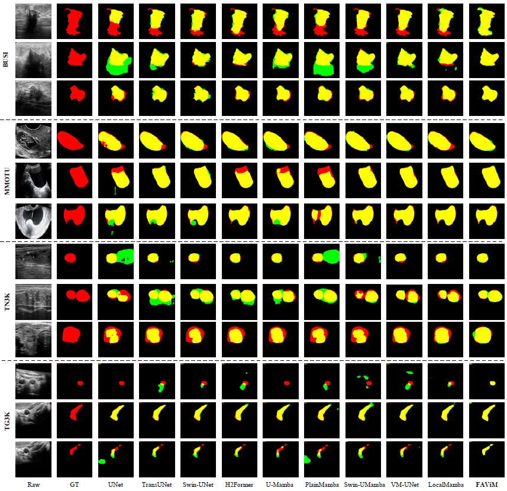

# FAViM

This repository contains the official PyTorch implementation of the following paper:

#### Frequency-Aware Vision Mamba with Deformable Windowed Selective Scan for Ultrasound Image Segmentation

Yan Liu, Yan Yang, Yongquan Jiang, Xiaole Zhao and Liang Fan

School of Computing and Artificial Intelligence, Southwest Jiaotong University  

## Abstract
Accurate segmentation of ultrasound images is crucial for medical diagnosis and treatment. However, achieving precise lesion segmentation is challenging due to inter-class indistinction caused by low contrast, high speckle noise, and blurred boundaries, as well as intra-class inconsistency resulting from variations in lesion size, shape, and location.
To address these challenges, we propose a frequency-aware vision mamba network (FAViM) with deformable windowed selective scan. Specifically, we introduce the frequency-aware selective state space (FAS6) layer, which utilizes fast Fourier transform to extract frequency-domain information and applies frequency-aware weighting to enhance discriminative features, effectively mitigating intra-class inconsistency. Moreover, we develop a deformable windowed selective scan (DWSS) module, which dynamically adjusts scanning paths by a learnable offset field to focus on ambiguous boundaries, significantly reducing inter-class indistinction.
Extensive experiments on four cross-domain ultrasound datasets demonstrate that FAViM outperforms other state-of-the-art methods, achieving Dice scores of 0.835, 0.832, 0.842, and 0.874 on BUSI, TG3K, TN3K, and MMOTU datasets respectively, with corresponding IoU scores of 0.758, 0.755, 0.760, and 0.804. %These results represent significant improvements over existing methods across all evaluation metrics.
Our results show that the proposed method provides a robust solution for clinical ultrasound image analysis, addressing inter-class indistinction and intra-class inconsistency challenges.


## The overall architecture


## Visual results on BUSI, TN3K, TG3K, and MMOTU datasets



## Main Environments
```bash
conda create -n FAViM python=3. 
conda activate FAViM
pip install torch==1.13.0 torchvision==0.14.0 torchaudio==0.13.0 --extra-index-url https://download.pytorch.org/whl/cu117
pip install packaging
pip install timm==0.4.12
pip install pytest chardet yacs termcolor
pip install submitit tensorboardX
pip install triton==2.0.0
pip install causal_conv1d==1.0.0  # causal_conv1d-1.0.0+cu118torch1.13cxx11abiFALSE-cp38-cp38-linux_x86_64.whl
pip install mamba_ssm==1.0.1  # mmamba_ssm-1.0.1+cu118torch1.13cxx11abiFALSE-cp38-cp38-linux_x86_64.whl
pip install scikit-learn matplotlib thop h5py SimpleITK scikit-image medpy yacs
```
The version of causal_conv1d can be found here. {[causal_conv1d](https://github.com/Dao-AILab/causal-conv1d/releases)} 
The version of mamba_ssm can be found here. {[mamba_ssm](https://github.com/state-spaces/mamba/releases/)}

## Prepare the datasets

### BUSI dataset
- The BUSI used for four-fold cross-validation, can be found here {[GoogleDrive](https://drive.google.com/file/d/1AOpPgSEAfgUS2w4rCGaJBbNYbRh3Z_FQ/view?usp=sharing)}.
- After downloading the datasets, you are supposed to put them into './TrainDataset/BUSI/', and the file format reference is as follows. (take the BUSI dataset as an example.)

- './TrainDataset/BUSI/'
  - Image
      - .png
  - Label
      - .png
  - data_split.json

### TN3K dataset

- For the TN3K dataset, can be found here {[GoogleDrive](https://drive.google.com/file/d/1-eDXzTgXrTTo7hcrWZnh_wVEtB92PBNz/view?usp=sharing)}.

- After downloading the datasets, you are supposed to put them into './TrainDataset/TN3K/', and the file format reference is as follows.

- './TrainDataset/TN3K/'
  - Image
      - .png
  - Label
      - .png
  - data_split.json

### TG3K dataset 
- For the TG3K dataset, can be found here {[GoogleDrive](https://drive.google.com/file/d/1k7JmMqDsEmd1KqpnPmHh8kK_38oJDTh2/view?usp=sharing)}.
- After downloading the datasets, you are supposed to put them into '/TrainDataset/TG3K/', and the file format reference is as follows.
- './TrainDataset/TG3K/'
  - Image
      - .png
  - Label
      - .png
  - data_split.json
 
### MMOTU dataset 
- For the MMOTU dataset, can be found here {[GoogleDrive]( )}.
- After downloading the datasets, you are supposed to put them into '/TrainDataset/MMOTU/', and the file format reference is as follows.
- './TrainDataset/MMOTU/'
  - Image
      - .png
  - Label
      - .png
  - data_split.json

## Prepare the pre_trained weights

| Tasks     |     weights |
|:----------|------------:|
| BUSI     | [weight](https://drive.google.com/file/d/1sOR_gxFEuFy4ofrJA2XRSVcpaZT9HT8B/view?usp=sharing) | 
| TN3K     | [weight]() |
| TG3K     | [weight](https://drive.google.com/file/d/1e16OoWkeTOgAPv6ayv9vn4d-uHfl371Z/view?usp=sharing) | 
| MMOTU    | [weight](https://drive.google.com/file/d/1R20ea_rZmkjjAgOe0husqieCSq49hX6o/view?usp=sharing) | 
The pretrain weight of LocalMamba can be found at [LocalMamba](https://drive.google.com/file/d/1CWP5atOLJYnoBr8Nx8159WJMNeSUe2ei/view?usp=sharing)

## Train and Infer on the FAViM 

### BUSI, TN3K, TG3K, and MMOTU tasks
```bash
cd FAViM
train: train_BUSI.py, train_TN3K.py, train_TG3K.py, train_MMOTU.py  
infer: test_BUSI.py, test_TN3K.py, test_TG3K.py, test_MMOTU.py  
```
```
- After training, you could obtain the results in './model/' 
- After inferring, you could obtain the results in './output/'


## 4. Acknowledgments

- We thank the authors of [VMUNet](https://github.com/JCruan519/VM-UNet), [LocalMamba](https://github.com/hunto/LocalMamba), and [xboundformer](https://github.com/jcwang123/xboundformer) for their open-source codes.
